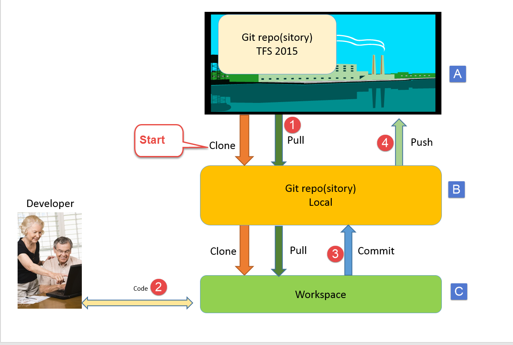
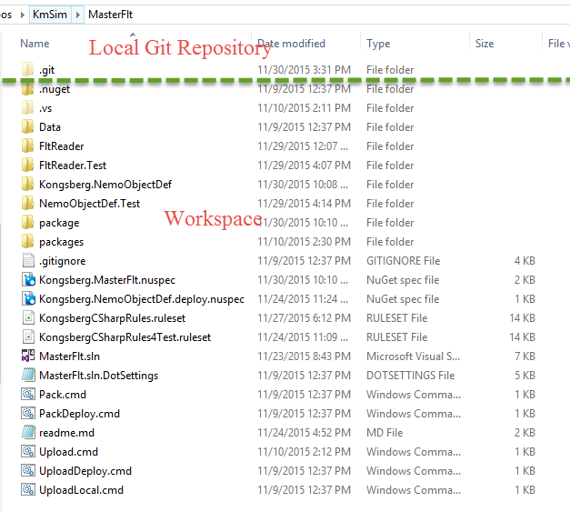

This guide is intended for those that feel the stuff on Git is [TL;DR](https://en.wikipedia.org/wiki/Wikipedia:Too_long;_didn%27t_read);, like this [great post](http://think-like-a-git.net/).    

It concentrates on the bare minimum you need to know in order to be able to use Git.  
It assumes you are using Visual Studio 2013 U4 or 2015. 
We start with a simple scenario, that of a single developer working alone.  With alone we mean, "at the same time".  

# Concepts   

## What are the basic elements of Git
   
A very quick introduction to the basic elements you need to know :    

Fig. 1   

### There are 3 storage locations in Git:   

*A:  A remote repository.  In KM we have this in our TFS Server, and they are currently located either in the Projects Team Project, or in parallel with the TFS VC in Nemo and EnterpriseApplications     
*B:  Your local Clone of the remote repository.  This clone is a full fledged source control system, with all the bells and whistles.    
*C: Your local workspace.  This is where your files you are working on are located.    

If you open your local git folder, it will look like this:   

Fig 2   

The git repository (B above), is the folder named .git.  Inside there is a lot of files, and you don't want to go in there.
The workspace is the rest of the files and folders in parallel with the .git folder.

## Scenario 1:  The basic workflow in Git is as follows:
See Fig 1 again.  

| Step   | Command   | Effect    |   
|:------:|:----------|:----------|
| Start  | Clone     | Clone copies from the external repository (A) and down into your local repository (B) and then also to your workspace (C). You do this only the first time.|
| 1      | Pull      | Copies new commits down from the remote repository (A), into your local repository (B) and also into your workspace(C)|
| 2      |  code     | Just work on the files in your workspace, local or using VS|
| 3      | Commit    |	Commit a set of files, add a comment, and optionally a work item ID (#12345). Moves these files into the local git repository (B).|
| 4      | Push      | Copies whatever is in your local git repository (B) (committed, and not formerly pushed), up to your remote git repository (A).|
{: rules="table"}

The first time only, you do the "Start" - which is to Clone. 

After first clone, the recommended work sequence - for a single developer - is

|Step   |Command   |Effect   |
|1|Pull|Gets the latest code down to your local repo and your workspace|
|2|code|Just work and code|
|3|Commit|	As many commits as you like|
|4|Push|Push to the server (at least daily, or better after each task is done)|

It is customary to commit very often during the day, and push when you have a set of commits, or at least a couple of times a day.  
Note that as long as things are in your local repository, you can regret, but once it is pushed, there are no regrets.

[How to do this in Visual Studio](GitScenario1InVS)

[Next :  Traps in Git](TrapsInGit)