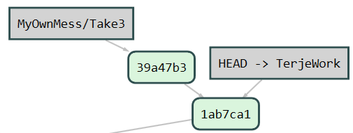

Things tend to go wrong, they always do. And there are different ways that things can go wrong.  
So we need ways to clean up and correct the things that go wrong.
This post is about what you to fix things **when** they go wrong. 

There is a [great flowchart by Justin Hileman](http://justinhileman.info/article/git-pretty/) that sorts out the different commands, when to use them and what they do.  We're going to walk through these and see how they are implemented in Visual Studio, and for what remains - point out where you need to use the command line.

# Simple cleanups

## Uncommitted mess

You have made a series of changes, and now it is just but a mess.  There are two things you can do, depending upon what you want to do with the mess:

### "I don't care about it" - Undo 

The undo is both in the Solution explorer, where you can undo one by one or all of them,  and in the Changes hub in the Team Explorer.

In both cases, just right click and choose Undo from the context menu

### "I might fix this later" - Store it in a separate branch

With git you don't need to create branches before you do your changes.  You can just as well create them afterwards, and you can create them when you have uncommitted files.  This is very handy for cases like this.

Just create a new local branch, like "MyOwnMess/Take3", which will point to the same commit as the branch we branch off from do.  Then commit your mess into this branch, and go back to the branch you branched off from. 

(1)  A file with some mess
(2) We see the changes in the Changes hub, in the current branch  "TerjeWork"
(3) Go to the Branches Hub, and create a new local branch
(4) Call it something meaningful and Create
(5) And we got a new branch

Now, if we look at the Changes Hub again, we see the same changes as in (2) above, but now in the new branch

This is nice, so now we can commit this.
When we commit this we see the following changes happening:

And we can then go back to the TerjeWork branch and continue without the mess, or more correctly, having the mess safely tucked away

# A little bit more advanced cleanups, using the Visual Studio Git cleanup tools

There are two places in Visual Studio where you see the real git tools for cleaning up.  One is the Branches hub in team explorer, and the second is the history view. 

There are 3 commands we can use,  Git revert,  Git reset hard and git reset mixed. 

## "I have committed, but should not had done that.  But I at least didn't push it" - Use Git reset

Go to the history view, you find this under many Team Explorer hubs, e.g.  the Changes Hub, under Actions - View History. 

Right click on the last one you want to keep.

You can do either mixed or hard reset

With mixed - keep changes, it means your commit will be removed, but the content of the commit will remain in your workspace as uncommitted files.

With hard - delete changes, it means your commit will be removed AND the contents of the commit will be deleted in your workspace.

After any of these, you will see (after using the refresh on the history) that the commit is gone.

(1) The former commit is gone  and (2) the files are back in uncommitted state (as I used the mixed option)

## "I pushed my commit too" - Use Git Revert

Git revert can save you when you have pushed your commit to the remote too.  But notice, it doesn't really **revert** your commit if you think of that as removing your commit.  What it does is that it creates a new commit that cancels out your changes. 

We have pushed up a messy commit.  And we choose to revert it:

And we see in the history (after a refresh) that we have now got a new commit:

***Trick**

If you inadvertently revert something, then you can do a Reset  -hard, and remove it again. 

