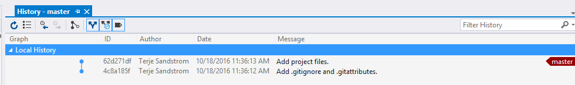
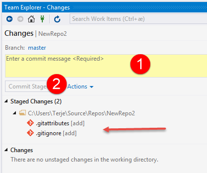

There are multiple ways to start a new git repository.  One can start on the client side and hook up to a server repo, or one can start at the server side and clone down afterwards.  

Most often you will need both a client instance and a server instance, and then you must create both of them.  The sequence in which you do this doesn't really matter, but there are a few things you should be aware of. 

One of the most important things to be aware of is that you have added a .gitignore file as the first commit in your new repo.  

We'll walk through a few of these scenarios:

1. Starting from the client 

1.1 Creating a git repo using the command line

This is the basics, and is what all the other tools also do behind the scenes. 

Go to the folder  you want to have a as git repo, open a command line prompt and do:

    git init

That's it.  The folder is now the workspace of your new git repo.
The next thing you need to do is to ensure your new repo has a .gitignore file.  This is the **most** important artefact to add to a git repo.  To get the most current .gitignore file, you can use the [IFix](https://visualstudiogallery.msdn.microsoft.com/b8ba97b0-bb89-4c21-a1e2-53ef335fd9cb) tool:

    IFix gitignore -r -f

Note that if you use this command, any existing gitignore will be overridden.  If you just want to merge anything new from the official gitignore (which is the one that IFix downloads), you can use the merge switch instead of the -r replace switch

    IFix gitignore -m -f

When you have created your gitignore file, you must stage and commit it:

    git add *
    git commit -m"Initial repo"

1.2 Creating a git repo using Visual Studio

You can create git repos in two ways using Visual Studio, 

a) When you create a new project

b) Directly from the Team Explorer connect hub

1.2.1  Creating a git repo when you create a new project

If you do a File/New Project, you get this dialog:

To create a new git repo on the same folder as the folder for the  solution file, check the "Create new Git repository" checkbox (2).  

Note that the solution and git repo for this will by default be where the Location is specified, and the default for this is different from the default for git repositories in general. 

When you have created the repo, and look in the history, you will see that it has added and committed a default gitignore and gitattributes files. 

1.2.2  Creating a git repo in the Team Explorer connect hub

If you go to the Team Explorer, and choose the Connect plug icon:

It is marked (1), and then you select from the Local Git Repositories, the New dropdown (2).  You can then enter the name of your new repo (3).  Note that this is by default created under the  yourusernamefolder/source/repos folder.  This is the default place for new git repos.  

After this, you need to go down the list of local repos, and locate your new repo, and then choose Open on it. 

You will also get default gitignore and gitattributes files here, but they will only be staged.  You need to do the final commit on them.

Add a comment "Initial code" (1) and then press the Commit Staged (2).

