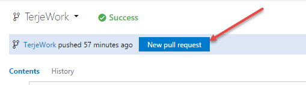
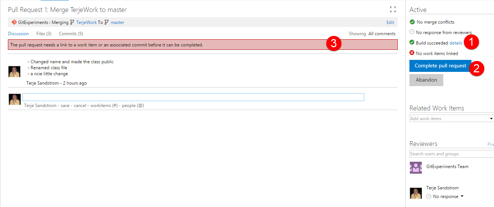
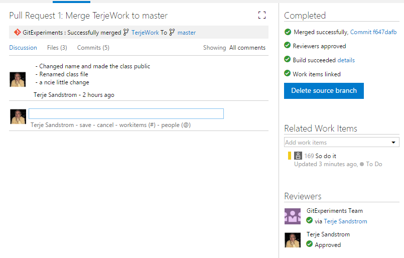

Scenario 4 is when you have multiple developers working together, and you need to release stable versions, and you would like to keep development going when releasing.  It is the foundation for moving to a Continuous Deployment scenario. 
It is also an excellent way of making sure the "official" code is following at least some of your best practices guidelines.
Using Pull Requests is built in to TFS and Visual Studio.

Pull requests is a mechanism where you explicitly ask the server to merge your changes (commits) into a target branch.  You can then set up rules for conditions for merging, and also a set of automatic steps that can be taken.  A pull requests is also the item on which you can ask for a code review.  This can also be automated. 

So a pull requests server multiple purposes.  It keeps the official code more clean, it opens up for code reviews, it ensures your stuff builds green before it goes into the official code base. 

For those coming from TFS VC, Pull Requests equals, no - surpasses, gated checkins.  
 
## Basic principles of using pull requests

### Principle 1:  Protect the release branch

Pull requests is based on having a protected branch, very often this is the master branch, where no one will have rights to push to.   The master branch is then the branch used for all (baseline) releases. 

If you release from other branches too, then those too should be procteced by using Pull Requests.

### Principle 2:  Set up CI build to trigger on commits to any branch

This is important, because when you activate pull requests it is common to require a green build.  

### Principle 3:  Push your commits  to any branch

You can push your changes to any remote branch.  This branch is then the source for the pull requests.

## Using Pull Requests

Pull requests are server actions, but can be started from the Branches Hub, by selecting a branch and choosing Create Pull Request.  It will take you to the Web Access Pull Request page, where you can add any relevant data

or you can create it from the Web Access

Before it really creates it, you will be presented with a set of information that you can add to:

1.   You can choose which master you want to be merged into
1.   It copies the comments into the descripion, but you can add more
1.   You can ask for your code to be reviewed. A mail with links will be sent to the reviewers, and they can comment on your code, and approve or reject the PR.
1.   If you forgot to add workitems to the commits, you can add them here.  This is really a last line of defence for work item linking, which is very nice to have.
1.   You get a list of the included commits.  
1.   You can for each file in the included commits, see what changes have been made. 

When ready, just press the New Pull Request button

You will then see the Pull Request page, and the server will check if the code can be merged in without conflicts or not.  If not, it will ask you to do the merge manually and resolve the conflicts.   
**Note:**  The merge you do manually is **from** the target **to** the source , that is the opposite way of how you want to merge the pull request.  The point here is that you don't disrupt the master, but get your work aligned with no conflicts in your own branch. 

You are alerted about the conflict (1), and if you press the help link (2) it will tell you how to proceed.

When you have fixed the conflict and pushed up the changes again to your branch, it will automatically be included in your pull request. 

It will now look like this:

1. No merge conflicts
1. One more commit have been added
1. And the reviewer can Approve your merge.  

Note that you can also just push the Complete Pull Request button, - without waiting for any reviewer or anything, that is because we have not enabled any policies for pull requests to this branch....  yet.

If we look at the build list, we will see that the pull request have been built too, and is green.

## Setting up policies

Setting up policies is normally done by the admins, but we will set it up like shown below, which is a pretty strict setup. 

*   We will require a green build
*   We will require a linked work item
*   We will require one other reviewer

Normally one would not allow users to approve their own changes, as shown, but in this case, I will enable that, so that I can get this in :-)

**Note 1:** These policies can be set per branch, so you can have multiple policies going at the same time.  
**Note 2:** When this is enabled, it will automatically disallow any direct pushes to the target branch
**Note 3:** When we require a reviewer that reviewer also must Approve the pull request for it to be merged in

If we enable this and push up another commit, the PR will show this:

If we now add a work item, it will still require a review to be done and approved, but when that is done, the merge will be done for us.

Notice that we now got a new merge commit.  It also offers to delete the source branch for us.  That makes sense if we worked out from a local work branch which we just published up.  If it is something that can have value as a tracking pointer, it should stay.  Again, the only thing being deleted is the branch pointer, no commits will be deleted.

