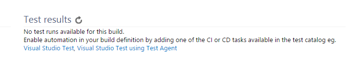

If testing doesn't work in TFS/VSTS Build, it may be because you have forgotten to include the NUnit/XUnit test adapter.   
The message you get in the web build result is a bit misleading:    

You dont need to add any new tasks, just include the NUnit Test Adapter from Nuget in one of your test projects

